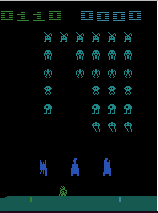

# Space Invaders Q-Learning Agent

This project demonstrates a simple Q-learning agent trained to play Atari's **Space Invaders** using [Gymnasium](https://github.com/Farama-Foundation/Gymnasium) and the Arcade Learning Environment (ALE). The agent uses visual preprocessing and a simplified 2-state space for learning.

## 🕹️ Features

- Classic **Space Invaders** via ALE
- Minimal Q-learning algorithm with epsilon-greedy exploration
- Basic screen preprocessing to detect invaders and shooter alignment
- Clean CLI visualization of the Q-table during training
- Live game rendering after training using OpenCV

---

## 🚀 Setup & Installation

Make sure you have Python 3.9+ installed. Then follow these steps:

### 1. Clone the repository
```bash
git clone https://github.com/charlesmraines/q-spaceinvaders.git
cd q-spaceinvaders
```

### 2. Create a virtual environment (optional but recommended)
```bash
conda create space_invaders
conda activate space_invaders
```

### 3. Install dependencies
```bash
pip install -r requirements.txt
```

### 4. Download Atari ROMs (once)
```bash
AutoROM --accept-license
```

---

## ▶️ Running the Code

```bash
python3 space_invaders.py
```

The script will:

1. **Train the Q-learning agent** over 1000 episodes (takes ~5–10 minutes depending on your system).
2. Display a **live-updating Q-table** every 100 episodes in the terminal.
3. After training, render the game in a window using OpenCV so you can **watch the agent play**.

Press `q` during the test phase to exit the game window.

---

## 🧠 How It Works

- The screen is preprocessed to extract a discretized state:
  - (shooter_bin, invader_bin, bullet_bin)
- The agent selects among 6 discrete actions using a Q-table:
  - `LEFT`, `RIGHT`, `FIRE`, etc.
- Rewards are used to iteratively update the Q-values during training.

---

## 📦 Requirements

All dependencies are listed in `requirements.txt`.

Install them using:

```bash
pip install -r requirements.txt
```

---

## 📝 Notes

- If you're running on a headless server or WSL, you may not see OpenCV windows unless you configure a virtual display.
- You can tune the number of episodes, learning rate, or state extraction logic to improve performance.

---

## 📷 Preview



---

## ✍️ Author

Charles Raines  
PhD Student in AI & Robotics  
[LinkedIn](https://www.linkedin.com/in/charles-m-raines)

---

## 📜 License

MIT License – free to use and modify.
